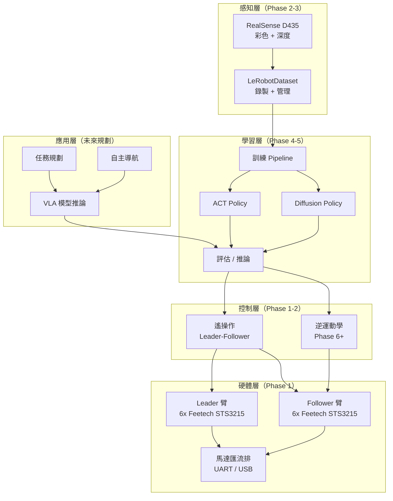

# 系統架構總覽

> 本文件採漸進式更新，每完成一個 Phase 後補充該階段的技術細節。

---

## 高層模組圖



### 模組狀態

| 模組 | 狀態 | 啟用階段 |
|------|------|---------|
| 硬體層（馬達、匯流排） | 未來規劃 | Phase 1 |
| Leader-Follower 遙操作 | 未來規劃 | Phase 1-2 |
| RealSense D435 攝影機 | 未來規劃 | Phase 2 |
| LeRobotDataset 錄製 | 未來規劃 | Phase 3 |
| ACT / Diffusion 訓練 | 未來規劃 | Phase 4 |
| 推論部署 | 未來規劃 | Phase 5 |
| 逆運動學 / 雙臂控制 | 未來規劃 | Phase 6 |
| Isaac Sim 模擬 | 未來規劃 | Phase 7 |
| 導航 / 任務規劃 | 未來規劃 | Phase 8 |

> 隨各 Phase 完成，狀態會更新為「已實作」並補充技術細節。

---

## 端到端資料流

```
遙操作（人類操作 Leader 臂）
    │
    ▼
錄製（Follower 臂動作 + 攝影機影像 → LeRobotDataset）
    │
    ▼
訓練（Dataset → ACT / Diffusion Policy → Checkpoint）
    │
    ▼
推論（Checkpoint → PolicyServer → Follower 臂執行）
```

### Phase 1 詳細架構：硬體通訊

```
┌──────────────┐    USB/UART     ┌──────────────────┐
│  電腦         │ ──────────────→ │  Waveshare 控制板  │
│  (Python)    │    1Mbaud       │  (Feetech 協議)    │
└──────────────┘                 └────────┬─────────┘
                                          │ TTL Bus
                              ┌───────────┼───────────┐
                              │           │           │
                         ┌────┴───┐  ┌────┴───┐  ┌────┴───┐
                         │ Motor  │  │ Motor  │  │ Motor  │
                         │ ID: 1  │  │ ID: 2  │  │  ...   │
                         └────────┘  └────────┘  └────────┘
```

- 每條 USB 線連一塊控制板，一塊控制板連 6 顆馬達（一隻臂）
- Leader 臂和 Follower 臂各用一條 USB，互不干擾
- 馬達 ID 1-6（Follower）、ID 1-6（Leader），各自在獨立匯流排上

---

## 未來架構擴充（Phase 完成後補充）

### Phase 6 — 雙臂控制架構
> Phase 6 完成後補充：雙臂同步控制、IK solver、座標系統

### Phase 7 — 模擬環境架構
> Phase 7 完成後補充：Isaac Sim 整合、URDF 模型、Sim-to-Real pipeline

### Phase 8 — 移動平台架構
> Phase 8 完成後補充：輪組控制、導航堆疊、移動+操作整合
