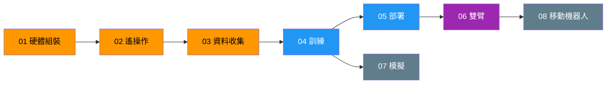

# Roadmap

## 狀態定義

| 狀態 | 說明 |
|------|------|
| `not-started` | 尚未開始 |
| `in-progress` | 進行中（同一時間最多 1-2 個） |
| `blocked` | 被阻擋（需註明 blocker） |
| `done` | 已完成 |
| `archived` | 已完成且不再活躍維護 |

---

## 全階段總覽

| Phase | 名稱 | 優先級 | 前置依賴 | 預期產出 | 狀態 |
|-------|------|--------|---------|---------|------|
| 01 | [硬體組裝](phases/01-hardware-setup.md) | P0 | 無 | 已校正的雙臂系統 | `in-progress` |
| 02 | [遙操作](phases/02-teleoperation.md) | P0 | Phase 01 | Leader-Follower 即時控制 + RealSense 串流 | `not-started` |
| 03 | [資料收集](phases/03-data-collection.md) | P0 | Phase 02 | 50+ 回合 pick & place 資料集 | `not-started` |
| 04 | [訓練](phases/04-training.md) | P1 | Phase 03 | 訓練好的 ACT checkpoint | `not-started` |
| 05 | [部署](phases/05-deployment.md) | P1 | Phase 04 | 可運行的推論系統（本地 + Jetson） | `not-started` |
| 06 | [雙臂](phases/06-dual-arm.md) | P2 | Phase 05 | 雙臂協調控制系統 | `not-started` |
| 07 | [模擬](phases/07-simulation.md) | P3 | Phase 04 | Isaac Sim 數位孿生 + Sim-to-Real pipeline | `not-started` |
| 08 | [移動機器人](phases/08-mobile-robot.md) | P3 | Phase 06 | XLeRobot 移動平台 | `not-started` |

### 優先級說明

- **P0**（現在就做）：Phase 1-3 — 硬體到資料收集的基本流程
- **P1**（下一步）：Phase 4-5 — 訓練與部署
- **P2**（中期）：Phase 6 — 雙臂改造
- **P3**（長期願景）：Phase 7-8 — 模擬與移動平台

---

## 依賴關係圖

**圖例**：橘色 = P0 | 藍色 = P1 | 紫色 = P2 | 灰色 = P3
