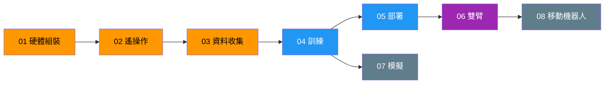
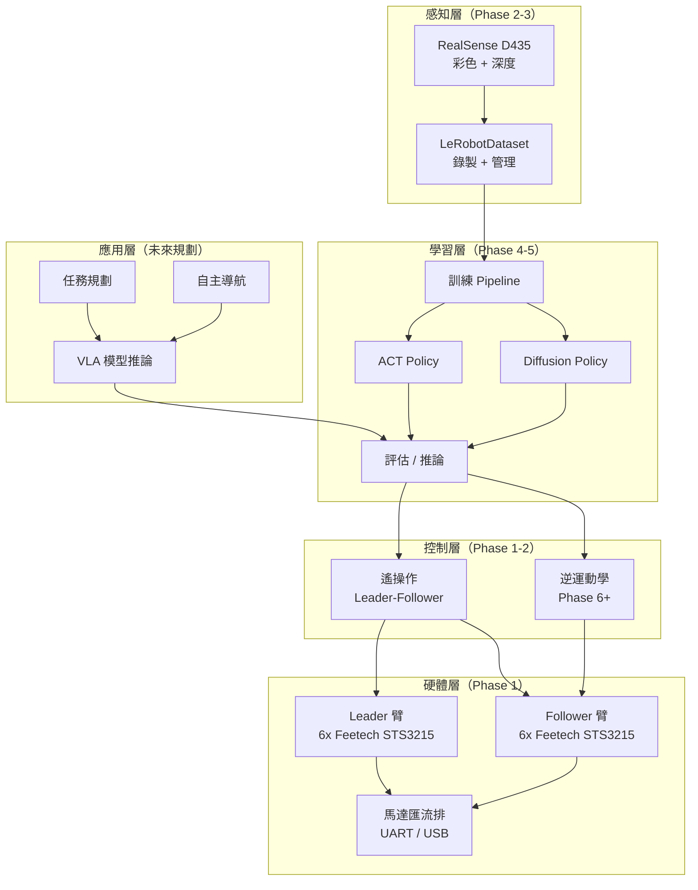

# SO-101 Docs Structure Implementation Plan

> **For agentic workers:** REQUIRED SUB-SKILL: Use superpowers:subagent-driven-development (recommended) or superpowers:executing-plans to implement this plan task-by-task. Steps use checkbox (`- [ ]`) syntax for tracking.

**Goal:** Create the complete `docs/` folder structure with all content files for the SO-101 robotics learning project.

**Architecture:** 18 markdown files across 6 directories. Core files (README, goals, roadmap, architecture) provide navigation and context. Phase files (01-08) provide actionable guides. Reference files (5) provide curated external resources. Journal provides development logging infrastructure.

**Tech Stack:** Markdown, Mermaid diagrams (GitHub-rendered)

**Spec:** `docs/superpowers/specs/2026-03-27-docs-structure-design.md`

**Language:** 繁體中文為主，專有名詞保留英文

---

## File Map

```
docs/
├── README.md                          # Task 4
├── goals.md                           # Task 1
├── roadmap.md                         # Task 2
├── architecture/
│   └── overview.md                    # Task 3
├── phases/
│   ├── 01-hardware-setup.md           # Task 5
│   ├── 02-teleoperation.md            # Task 5
│   ├── 03-data-collection.md          # Task 5
│   ├── 04-training.md                 # Task 6
│   ├── 05-deployment.md               # Task 6
│   ├── 06-dual-arm.md                 # Task 7
│   ├── 07-simulation.md               # Task 7
│   └── 08-mobile-robot.md             # Task 7
├── references/
│   ├── hardware.md                    # Task 8
│   ├── algorithms.md                  # Task 8
│   ├── software.md                    # Task 8
│   ├── simulation.md                  # Task 9
│   └── community-projects.md          # Task 9
└── journal/
    └── _index.md                      # Task 10
```

## Execution Model: Subagent with Patch Artifact

本 plan 使用多 subagent 並行執行。為避免 commit/merge 衝突，採用以下整合規則：

1. **Subagent 只寫檔案，不做 git commit** — 每個 subagent 只負責建立目錄和寫入 markdown 檔案
2. **主 agent 統一整合與提交** — 所有 subagent 完成後，由主 agent review 產出物並統一 commit
3. **無 branch 隔離** — 所有 subagent 寫入同一個工作目錄，因為各 task 產出的檔案路徑互不重疊

## Execution Order

**Phase 1（順序）：** Tasks 1 → 2 → 3 → 4（核心文件有依賴：goals → roadmap → architecture → README）

**Phase 2（並行）：** 以下三組同時執行，產出檔案無重疊：
- **Group A:** Tasks 5, 6, 7（phases/ 下的 8 個檔案）
- **Group B:** Tasks 8, 9（references/ 下的 5 個檔案）
- **Group C:** Task 10（journal/_index.md）

**Phase 3（主 agent）：** Review 所有產出 → 統一 `git add` + `git commit`

---

### Task 1: goals.md — 願景與目標

**Files:**
- Create: `docs/goals.md`

- [ ] **Step 1: Create `docs/goals.md`**

```markdown
# 願景與目標

## 願景

打造一台具備**雙臂操作**與**自主移動**能力的家庭機器人，從 LeRobot SO-101 單臂出發，逐步演進至 XLeRobot 移動平台。

本專案同時是一份**可重現的學習紀錄**，讓其他想入門機器手臂的開發者能按照相同路徑，從零開始完成整個流程。

---

## 階段目標

### Phase 1-5：掌握 LeRobot 全流程（單臂）

| Phase | 學會什麼 |
|-------|---------|
| 01 硬體組裝 | Feetech 伺服馬達控制、UART 通訊、機械臂校正 |
| 02 遙操作 | Leader-Follower 即時控制、RealSense D435 彩色+深度串流 |
| 03 資料收集 | LeRobotDataset 格式、資料品質管理、HuggingFace Hub 上傳 |
| 04 訓練 | ACT / Diffusion Policy 訓練、多 GPU 加速、實驗追蹤 |
| 05 部署 | 本地推論、Jetson 邊緣部署、非同步 PolicyServer/RobotClient |

### Phase 6：雙臂協調

- 將 Leader 臂改裝為第二隻 Follower 臂
- 學會雙臂校正、協調控制、解析逆運動學

### Phase 7：模擬環境 + Sim-to-Real

- 在 Isaac Sim / MuJoCo 中建立 SO-101 數位孿生
- 使用 Isaac Lab 進行 RL 訓練
- 完成 Sim-to-Real 遷移

### Phase 8：XLeRobot 移動平台

- 將雙臂裝上輪式底盤（IKEA RASKOG 推車）
- 整合導航（LIDAR / RGBD）
- 實現移動 + 操作的端到端任務

---

## 成功標準

每個階段需滿足兩類指標：

### 任務成功率

| Phase | 指標 |
|-------|------|
| 01 | `lerobot-calibrate` 通過，所有 6 個關節可獨立控制 |
| 02 | 遙操作主觀連續可控，實測 latency 有記錄 |
| 03 | 完成 50+ 回合 pick & place 資料集 |
| 04 | loss 收斂 + validation/replay/offline eval 有可解釋結果 |
| 05 | 機器手臂執行訓練任務成功率 > 80% |
| 06 | 雙臂可獨立或協同執行任務 |
| 07 | 模擬訓練的策略可在實體臂上執行 |
| 08 | 機器人可移動到指定位置並執行操作任務 |

### Reproducibility 指標

每個階段完成後必須留下：
- **可重新執行的指令流程**：從零開始照做就能重現結果
- **固定的資料集版本**：資料集有版本號，已上傳 HuggingFace Hub
- **可重現的訓練設定**：超參數、隨機種子、環境版本皆記錄在案
- **驗證影片或 metrics**：可視化的成功證據

---

## 硬體演進圖

```
Phase 1-5                Phase 6                   Phase 7-8
┌─────────────┐     ┌─────────────────┐     ┌──────────────────────┐
│  SO-101     │     │  雙臂桌面版      │     │  XLeRobot 移動機器人  │
│  單臂       │ ──→ │  2x SO-101      │ ──→ │  雙臂 + 輪式底盤      │
│  Leader +   │     │  雙 Follower    │     │  + 導航 + VLA         │
│  Follower   │     │  + RealSense    │     │  + Jetson 邊緣推論    │
└─────────────┘     └─────────────────┘     └──────────────────────┘
```

---

## 硬體清單

| 設備 | 用途 | 啟用階段 |
|------|------|---------|
| SO-101 Leader 臂 | 遙操作輸入 → Phase 6 改裝為 Follower | Phase 1 |
| SO-101 Follower 臂 | 任務執行 | Phase 1 |
| Intel RealSense D435 | 彩色 + 深度感知 | Phase 2 |
| 5x Quadro RTX 8000 (240GB) | 模型訓練 | Phase 4 |
| NVIDIA Jetson Orin Nano 8GB | 邊緣推論 | Phase 5 |
| IKEA RASKOG 推車 + 輪組 | 移動底盤 | Phase 8 |
```

- [ ] **Step 2: Verify file renders correctly**

Run: `head -5 docs/goals.md`
Expected: `# 願景與目標` as first line

- [ ] **Step 3: Verify** — 不要 commit，主 agent 會統一提交

---

### Task 2: roadmap.md — 全階段 Roadmap

**Files:**
- Create: `docs/roadmap.md`

- [ ] **Step 1: Create `docs/roadmap.md`**

```markdown
# Roadmap

## 狀態定義

| 狀態 | 說明 |
|------|------|
| `not-started` | 尚未開始 |
| `in-progress` | 進行中（同一時間最多 1-2 個） |
| `blocked` | 被阻擋（需註明 blocker） |
| `done` | 已完成 |
| `archived` | 已完成且不再活躍維護 |

---

## 全階段總覽

| Phase | 名稱 | 優先級 | 前置依賴 | 預期產出 | 狀態 |
|-------|------|--------|---------|---------|------|
| 01 | [硬體組裝](phases/01-hardware-setup.md) | P0 | 無 | 已校正的雙臂系統 | `not-started` |
| 02 | [遙操作](phases/02-teleoperation.md) | P0 | Phase 01 | Leader-Follower 即時控制 + RealSense 串流 | `not-started` |
| 03 | [資料收集](phases/03-data-collection.md) | P0 | Phase 02 | 50+ 回合 pick & place 資料集 | `not-started` |
| 04 | [訓練](phases/04-training.md) | P1 | Phase 03 | 訓練好的 ACT checkpoint | `not-started` |
| 05 | [部署](phases/05-deployment.md) | P1 | Phase 04 | 可運行的推論系統（本地 + Jetson） | `not-started` |
| 06 | [雙臂](phases/06-dual-arm.md) | P2 | Phase 05 | 雙臂協調控制系統 | `not-started` |
| 07 | [模擬](phases/07-simulation.md) | P3 | Phase 04 | Isaac Sim 數位孿生 + Sim-to-Real pipeline | `not-started` |
| 08 | [移動機器人](phases/08-mobile-robot.md) | P3 | Phase 06 | XLeRobot 移動平台 | `not-started` |

### 優先級說明

- **P0**（現在就做）：Phase 1-3 — 硬體到資料收集的基本流程
- **P1**（下一步）：Phase 4-5 — 訓練與部署
- **P2**（中期）：Phase 6 — 雙臂改造
- **P3**（長期願景）：Phase 7-8 — 模擬與移動平台

---

## 依賴關係圖



**圖例**：橘色 = P0 | 藍色 = P1 | 紫色 = P2 | 灰色 = P3
```

- [ ] **Step 2: Verify** — 不要 commit，主 agent 會統一提交

---

### Task 3: architecture/overview.md — 系統架構

**Files:**
- Create: `docs/architecture/overview.md`

- [ ] **Step 1: Create directory and file**

```bash
mkdir -p docs/architecture
```

- [ ] **Step 2: Create `docs/architecture/overview.md`**

```markdown
# 系統架構總覽

> 本文件採漸進式更新，每完成一個 Phase 後補充該階段的技術細節。

---

## 高層模組圖



### 模組狀態

| 模組 | 狀態 | 啟用階段 |
|------|------|---------|
| 硬體層（馬達、匯流排） | 未來規劃 | Phase 1 |
| Leader-Follower 遙操作 | 未來規劃 | Phase 1-2 |
| RealSense D435 攝影機 | 未來規劃 | Phase 2 |
| LeRobotDataset 錄製 | 未來規劃 | Phase 3 |
| ACT / Diffusion 訓練 | 未來規劃 | Phase 4 |
| 推論部署 | 未來規劃 | Phase 5 |
| 逆運動學 / 雙臂控制 | 未來規劃 | Phase 6 |
| Isaac Sim 模擬 | 未來規劃 | Phase 7 |
| 導航 / 任務規劃 | 未來規劃 | Phase 8 |

> 隨各 Phase 完成，狀態會更新為「已實作」並補充技術細節。

---

## 端到端資料流

```
遙操作（人類操作 Leader 臂）
    │
    ▼
錄製（Follower 臂動作 + 攝影機影像 → LeRobotDataset）
    │
    ▼
訓練（Dataset → ACT / Diffusion Policy → Checkpoint）
    │
    ▼
推論（Checkpoint → PolicyServer → Follower 臂執行）
```

### Phase 1 詳細架構：硬體通訊

```
┌──────────────┐    USB/UART     ┌──────────────────┐
│  電腦         │ ──────────────→ │  Waveshare 控制板  │
│  (Python)    │    1Mbaud       │  (Feetech 協議)    │
└──────────────┘                 └────────┬─────────┘
                                          │ TTL Bus
                              ┌───────────┼───────────┐
                              │           │           │
                         ┌────┴───┐  ┌────┴───┐  ┌────┴───┐
                         │ Motor  │  │ Motor  │  │ Motor  │
                         │ ID: 1  │  │ ID: 2  │  │  ...   │
                         └────────┘  └────────┘  └────────┘
```

- 每條 USB 線連一塊控制板，一塊控制板連 6 顆馬達（一隻臂）
- Leader 臂和 Follower 臂各用一條 USB，互不干擾
- 馬達 ID 1-6（Follower）、ID 1-6（Leader），各自在獨立匯流排上

---

## 未來架構擴充（Phase 完成後補充）

### Phase 6 — 雙臂控制架構
> Phase 6 完成後補充：雙臂同步控制、IK solver、座標系統

### Phase 7 — 模擬環境架構
> Phase 7 完成後補充：Isaac Sim 整合、URDF 模型、Sim-to-Real pipeline

### Phase 8 — 移動平台架構
> Phase 8 完成後補充：輪組控制、導航堆疊、移動+操作整合
```

- [ ] **Step 3: Verify** — 不要 commit，主 agent 會統一提交

---

### Task 4: README.md — 導覽首頁

**Files:**
- Create: `docs/README.md`

- [ ] **Step 1: Create `docs/README.md`**

```markdown
# SO-101 機器手臂學習專案

從 LeRobot SO-101 單臂機器人出發，逐步演進至 XLeRobot 雙臂移動機器人的完整學習旅程。

---

## Current Focus

| 項目 | 內容 |
|------|------|
| 現在做什麼 | Phase 1 — 硬體組裝與校正 |
| 下一步 | Phase 2 — 遙操作 + RealSense D435 設定 |
| 目前 Blocker | 無 |

---

## 硬體清單

| 設備 | 規格 | 用途 |
|------|------|------|
| SO-101 機械臂 x2 | 6-DOF, Feetech STS3215 | Leader + Follower（之後改雙臂） |
| Intel RealSense D435 | 彩色 + 深度攝影機 | 視覺感知 |
| NVIDIA Jetson Orin Nano | 8GB, SUPER Developer Kit | 邊緣推論 |
| 訓練工作站 | 5x RTX 8000 (240GB), 2x Xeon Gold 6248R, 754GB RAM | 模型訓練 |

---

## 快速導覽

| 文件 | 說明 |
|------|------|
| [願景與目標](goals.md) | 專案願景、階段目標、成功標準 |
| [Roadmap](roadmap.md) | 全階段時程、優先級、依賴關係 |
| [系統架構](architecture/overview.md) | 高層模組圖、資料流、技術細節 |
| [Phase 01 — 硬體組裝](phases/01-hardware-setup.md) | 當前進行中的階段 |
| [參考資料](references/) | 分類整理的外部資源 |
| [開發日誌](journal/_index.md) | 每週進度紀錄 |

---

## 給新手：從哪裡開始？

1. 先讀 [願景與目標](goals.md) 了解這個專案要做什麼
2. 看 [Roadmap](roadmap.md) 了解整體規劃
3. 從 [Phase 01 — 硬體組裝](phases/01-hardware-setup.md) 開始跟著做
4. 遇到問題可以查 [參考資料](references/) 或 [開發日誌](journal/_index.md) 的踩坑紀錄

---

## 最新開發日誌

> 尚未開始記錄，第一篇日誌將在 Phase 1 啟動後撰寫。
```

- [ ] **Step 2: Verify** — 不要 commit，主 agent 會統一提交

---

### Task 5: Phase 01-03（P0 詳細版）

**Files:**
- Create: `docs/phases/01-hardware-setup.md`
- Create: `docs/phases/02-teleoperation.md`
- Create: `docs/phases/03-data-collection.md`

- [ ] **Step 1: Create phases directory**

```bash
mkdir -p docs/phases
```

- [ ] **Step 2: Create `docs/phases/01-hardware-setup.md`**

```markdown
# Phase 01 — 硬體組裝

## 目標

完成 SO-101 Leader 臂和 Follower 臂的組裝、馬達設定與校正，確保所有關節可正常控制。

## 前置條件

- SO-101 零件齊全（馬達、控制板、3D 列印結構件、螺絲）
- 電腦已安裝 Python 3.10+
- USB 連接線 x2

## 輸入 / 輸出

- **輸入**：未組裝的零件
- **輸出**：已校正的 Leader + Follower 臂、校正檔、已驗證的 USB port 設定

## 步驟

### 1. 環境安裝

```bash
# 使用 uv 建立專案環境
uv init
uv venv
source .venv/bin/activate

# 安裝 LeRobot + Feetech 支援
uv pip install lerobot
uv pip install "lerobot[feetech]"

# 驗證安裝
lerobot-info
```

### 2. 組裝機械臂

按照 [LeRobot SO-101 官方文件](https://huggingface.co/docs/lerobot/so101) 的步驟組裝：
- Follower 臂：6x STS3215（齒輪比 1/345）
- Leader 臂：6x STS3215（混合齒輪比，詳見官方 BOM）
- 注意馬達方向和螺絲扭力

### 3. 找到 USB Port

```bash
lerobot-find-port
```

記錄 Follower 和 Leader 各自的 port（例如 `/dev/tty.usbmodem*` 或 `/dev/ttyACM*`）。

### 4. 設定馬達 ID 和鮑率

**一次只接一顆馬達**，逐一設定 ID：

```bash
# Follower 臂（6 顆馬達，ID 1-6）
lerobot-setup-motors --robot.type=so101_follower --robot.port=/dev/ttyXXX

# Leader 臂（6 顆馬達，ID 1-6）
lerobot-setup-motors --teleop.type=so101_leader --teleop.port=/dev/ttyYYY
```

### 5. 校正

```bash
# 校正 Follower
lerobot-calibrate --robot.type=so101_follower --robot.port=/dev/ttyXXX --robot.id=my_follower

# 校正 Leader
lerobot-calibrate --teleop.type=so101_leader --teleop.port=/dev/ttyYYY --teleop.id=my_leader
```

校正時需將手臂擺到指定位姿，按照終端提示操作。

## 驗證方式

1. `lerobot-calibrate` 指令成功完成，無錯誤訊息
2. 手動測試：用手轉動每個關節，確認馬達回報的角度值合理
3. 校正檔已生成在 `~/.cache/huggingface/lerobot/calibration/` 目錄下

## 關鍵連結

- [LeRobot SO-101 官方教學](https://huggingface.co/docs/lerobot/so101)
- [Feetech STS3215 Datasheet](../references/hardware.md)
- [LeRobot GitHub](https://github.com/huggingface/lerobot)

## 成功標準

- [ ] 所有 12 顆馬達（6 Follower + 6 Leader）ID 設定完成
- [ ] `lerobot-calibrate` 雙臂皆通過
- [ ] 所有 6 個關節可獨立控制（Follower）
- [ ] 校正檔已備份
- [ ] 以上步驟可從零重現（指令已記錄）

## 產出物

- 校正檔：`~/.cache/huggingface/lerobot/calibration/my_follower/`
- 校正檔：`~/.cache/huggingface/lerobot/calibration/my_leader/`
- USB port 記錄（記在本文件的步驟 3）

## 踩坑紀錄

> Phase 1 完成後補充。

## 風險 / Blockers

- **USB port 辨識**：macOS 上 port 名稱可能在重新插拔後改變，建議用 `lerobot-find-port` 確認
- **馬達 ID 衝突**：設定 ID 時一次只能接一顆馬達，否則會衝突
- **馬達方向**：組裝時注意馬達轉軸方向，裝反會導致校正失敗
```

- [ ] **Step 3: Create `docs/phases/02-teleoperation.md`**

```markdown
# Phase 02 — 遙操作

## 目標

建立 Leader-Follower 即時遙操作系統，整合 Intel RealSense D435 攝影機（彩色 + 深度），確保控制迴圈穩定。

## 前置條件

- Phase 01 完成（雙臂已校正）
- Intel RealSense D435 已連接
- RealSense SDK 已安裝

## 輸入 / 輸出

- **輸入**：已校正的 Leader + Follower 臂、RealSense D435
- **輸出**：穩定運行的遙操作系統、攝影機串流驗證、latency 記錄

## 步驟

### 1. 安裝 RealSense 支援

```bash
# macOS / Linux
uv pip install pyrealsense2

# 驗證攝影機偵測
lerobot-find-cameras realsense
```

記錄攝影機的 serial number。

### 2. 測試遙操作（無攝影機）

先確認 Leader-Follower 動作鏡像正常：

```bash
# 基本遙操作測試
# 移動 Leader 臂，觀察 Follower 是否即時跟隨
# 參考 LeRobot 文件中的 teleoperation 章節
```

### 3. 加入 RealSense 攝影機

設定攝影機參數：
- 解析度：640x480 或 1280x720
- FPS：30
- 啟用深度：`use_depth=True`

### 4. 記錄 Latency

在遙操作過程中記錄：
- Leader → Follower 動作延遲
- 攝影機幀率穩定性
- 是否有明顯掉幀

## 驗證方式

1. Leader 臂移動 → Follower 臂即時鏡像（目視判斷連續、可控）
2. `lerobot-find-cameras realsense` 可偵測到 D435
3. 攝影機串流穩定（無頻繁掉幀）
4. 深度影像可正常顯示

## 關鍵連結

- [LeRobot 攝影機文件](https://huggingface.co/docs/lerobot/so101)
- [RealSense D435 SDK](../references/hardware.md)
- [RealSenseCamera API](../references/software.md)

## 成功標準

- [ ] Leader-Follower 遙操作穩定運行
- [ ] 操作主觀上連續、可控
- [ ] 實測 latency 已記錄（目標值 < 50ms，但不作硬性 gate）
- [ ] RealSense D435 彩色 + 深度串流正常
- [ ] 攝影機串流可持續運行 5 分鐘以上不中斷

## 產出物

- Latency 測試記錄
- 攝影機設定參數（解析度、FPS、serial number）
- 遙操作測試影片（可選）

## 踩坑紀錄

> Phase 2 完成後補充。

## 風險 / Blockers

- **RealSense macOS 驅動**：已知不穩定，可能需要 `sudo` 或改用 Linux
- **USB 頻寬**：兩隻臂 + 攝影機同時用 USB，可能有頻寬問題，建議分開 USB controller
- **深度品質**：D435 在近距離（< 20cm）深度精度下降
```

- [ ] **Step 4: Create `docs/phases/03-data-collection.md`**

```markdown
# Phase 03 — 資料收集

## 目標

規劃資料集結構、錄製 50+ 回合的 pick & place 示範資料、驗證資料品質、上傳至 HuggingFace Hub。

## 前置條件

- Phase 02 完成（遙操作 + 攝影機穩定運行）
- HuggingFace 帳號已建立
- 訓練用的物件（例如小方塊、杯子）

## 輸入 / 輸出

- **輸入**：穩定運行的遙操作系統 + 攝影機串流
- **輸出**：已上傳的 LeRobotDataset（含版本號）、資料集品質報告

## 步驟

### 1. 規劃資料集

決定以下參數：
- **任務名稱**：`pick_and_place_cube`（或自訂）
- **Dataset repo ID**：`your_username/so101_pick_place_v1`
- **攝影機數量與角度**：建議至少 2 個視角（正面 + 手腕）
- **FPS**：30
- **每回合時長**：約 10-20 秒

### 2. 錄製資料集

```bash
# 錄製指令（參考 LeRobot 文件，實際參數依 Phase 2 的設定調整）
# --robot.type=so101_follower
# --teleop.type=so101_leader
# --dataset.repo_id=your_username/so101_pick_place_v1
# --episodes=50
# --fps=30
```

錄製要點：
- 每回合開始和結束位置盡量一致
- 動作要自然、不要太快
- 參考 eta_0.1 專案的發現：**40 個有策略變化的示範 > 100 個重複動作**
- 考慮加入位置擾動（物件擺放位置微調 ±3-5cm）

### 3. 品質檢查

錄製完成後：
- 回放每個 episode 確認動作品質
- 刪除失敗的 episode
- 確認攝影機影像無損壞
- 確認資料集大小合理

### 4. 上傳至 HuggingFace Hub

```bash
# 上傳資料集
huggingface-cli login
# 資料集錄製完成後會自動提示是否上傳
```

### 5. 資料集版本化

- 記錄版本號（v1）
- 記錄錄製環境（OS、LeRobot 版本、攝影機設定）
- 記錄物件描述和擺放方式

## 驗證方式

1. 資料集可在 HuggingFace Hub 上瀏覽
2. 使用 LeRobot 的 dataset viewer 回放至少 5 個 episode
3. 影像清晰、動作完整、無損壞的 episode

## 關鍵連結

- [LeRobotDataset 格式文件](../references/software.md)
- [HuggingFace Hub Dataset 管理](../references/software.md)
- [eta_0.1 資料集設計經驗](../references/community-projects.md)

## 成功標準

- [ ] 完成 50+ 回合有效示範
- [ ] 資料集已上傳 HuggingFace Hub，有明確版本號
- [ ] 至少 2 個攝影機視角
- [ ] 錄製指令可從零重現（指令 + 環境版本已記錄）
- [ ] 資料品質已目視檢查通過

## 產出物

- HuggingFace Dataset repo：`your_username/so101_pick_place_v1`
- 資料集元資料（版本、環境、參數）
- 品質檢查紀錄

## 踩坑紀錄

> Phase 3 完成後補充。

## 風險 / Blockers

- **資料品質不一致**：人類操作有變異性，建議錄製前先練習幾次
- **儲存空間**：影片資料集可能很大，確認磁碟空間充足
- **攝影機同步**：多攝影機時需確認幀同步
```

- [ ] **Step 5: Verify** — 確認 3 個檔案皆已建立，不要 commit，主 agent 會統一提交

---

### Task 6: Phase 04-05（P1 詳細版）

**Files:**
- Create: `docs/phases/04-training.md`
- Create: `docs/phases/05-deployment.md`

- [ ] **Step 1: Create `docs/phases/04-training.md`**

```markdown
# Phase 04 — 訓練

## 目標

使用收集的資料集訓練 ACT 策略模型，設定多 GPU 訓練環境，追蹤實驗結果，產出可用的 checkpoint。

## 前置條件

- Phase 03 完成（資料集已上傳 HuggingFace Hub）
- 訓練工作站可用（5x RTX 8000）
- WandB 帳號已建立（可選但建議）

## 輸入 / 輸出

- **輸入**：HuggingFace 上的 LeRobotDataset
- **輸出**：訓練好的 ACT checkpoint、訓練 log、超參數記錄

## 步驟

### 1. 訓練環境設定

```bash
# 在訓練工作站上
uv venv
source .venv/bin/activate
uv pip install lerobot
uv pip install "lerobot[feetech]"
uv pip install accelerate wandb

# 驗證 GPU
python -c "import torch; print(torch.cuda.device_count())"
# 預期輸出：5
```

### 2. 單 GPU 訓練（先驗證流程）

```bash
lerobot-train \
  --policy=act \
  --dataset.repo_id=your_username/so101_pick_place_v1
```

確認訓練可以正常啟動、loss 在下降。

### 3. 多 GPU 訓練

```bash
# 設定 accelerate
accelerate config
# 選擇 multi-GPU、選擇 GPU 數量

# 啟動多 GPU 訓練
accelerate launch --multi_gpu --num_processes=5 $(which lerobot-train) \
  --policy=act \
  --dataset.repo_id=your_username/so101_pick_place_v1
```

注意事項：
- effective batch size = batch_size x num_gpus
- learning rate 和 training steps 不會自動調整，需手動調整
- WandB logging 只在 main process 上執行

### 4. 實驗追蹤

```bash
# 啟用 WandB
wandb login
# 訓練指令中加入 wandb 相關參數
```

記錄每次實驗的：
- 超參數（learning rate、batch size、epochs、action chunk size）
- 訓練曲線（loss）
- 驗證結果

### 5. 評估 Checkpoint

訓練完成後，不要只看 loss：
- 用 offline evaluation 檢查策略行為
- 用 replay 回放動作軌跡
- 如果有模擬環境，跑模擬 eval

## 驗證方式

1. 訓練 loss 曲線持續下降並收斂
2. WandB dashboard 顯示完整的訓練記錄
3. Offline evaluation 的動作軌跡合理（不飄移、不震盪）
4. Checkpoint 檔案可正常載入

## 關鍵連結

- [LeRobot 訓練文件](../references/software.md)
- [ACT 論文](../references/algorithms.md)
- [accelerate 多 GPU 設定](../references/software.md)
- [eta_0.1 訓練經驗：小模型 + 獨立編碼器優於大模型](../references/community-projects.md)

## 成功標準

- [ ] 訓練 loss 收斂
- [ ] Validation / replay / offline eval 有可解釋的結果
- [ ] Checkpoint 可正常載入和執行推論
- [ ] 超參數、訓練設定已完整記錄（可重現）
- [ ] WandB 實驗記錄已儲存

## 產出物

- ACT checkpoint（含路徑和版本）
- WandB 實驗連結
- 超參數記錄（YAML 或 JSON）
- 訓練環境版本記錄（Python、PyTorch、CUDA、LeRobot）

## 踩坑紀錄

> Phase 4 完成後補充。

## 風險 / Blockers

- **CUDA 版本相容**：工作站 CUDA runtime 13.0 / nvcc 12.0，需確認 PyTorch 相容
- **多 GPU 同步**：5 張卡的梯度同步可能有效能瓶頸
- **過擬合**：50 回合資料可能不夠，需觀察 validation 結果決定是否補錄
```

- [ ] **Step 2: Create `docs/phases/05-deployment.md`**

```markdown
# Phase 05 — 部署

## 目標

將訓練好的策略模型部署到真實機器手臂，驗證任務成功率，並設定 Jetson Orin Nano 邊緣推論環境。

## 前置條件

- Phase 04 完成（有可用的 ACT checkpoint）
- Jetson Orin Nano 已完成基本設定（JetPack SDK）

## 輸入 / 輸出

- **輸入**：訓練好的 ACT checkpoint
- **輸出**：可運行的推論系統、任務成功率報告、Jetson 部署設定

## 步驟

### 1. 本地推論測試

```bash
# 在訓練用的電腦上直接推論
# 載入 checkpoint，控制 Follower 臂執行 pick & place
```

反覆測試 10+ 次，記錄成功/失敗次數。

### 2. 非同步推論架構

```bash
uv pip install "lerobot[async]"
```

設定 PolicyServer（GPU 機器）+ RobotClient（機器人端）：
- PolicyServer 負責模型推論
- RobotClient 負責馬達控制和感測器讀取
- 兩者透過網路通訊，可在同一台或不同機器上

### 3. Jetson Orin Nano 部署

```bash
# 在 Jetson 上
# 安裝 LeRobot（注意 ARM 架構相容性）
# 設定為 RobotClient
# PolicyServer 可跑在工作站上，也可以嘗試跑在 Jetson 上（小模型如 SmolVLA ~2GB VRAM）
```

### 4. 成功率測試

進行正式測試：
- 連續執行 20 次 pick & place
- 記錄每次結果（成功/失敗/部分成功）
- 錄影留存

## 驗證方式

1. 本地推論成功執行 pick & place
2. 非同步推論架構正常運行
3. Jetson 可作為 RobotClient 連接到 PolicyServer
4. 20 次測試中成功率 > 80%（16+ 次成功）

## 關鍵連結

- [LeRobot 非同步推論文件](../references/software.md)
- [Jetson Orin Nano 設定指南](../references/hardware.md)
- [PolicyServer / RobotClient 架構](../references/software.md)

## 成功標準

- [ ] 本地推論可正常執行任務
- [ ] Pick & place 成功率 > 80%（20 次測試）
- [ ] 非同步推論架構可運行
- [ ] Jetson Orin Nano 可作為 RobotClient
- [ ] 測試結果已記錄（含影片）

## 產出物

- 成功率測試報告（20 次結果）
- 測試影片
- Jetson 部署設定和步驟記錄
- 非同步推論的網路設定

## 踩坑紀錄

> Phase 5 完成後補充。

## 風險 / Blockers

- **Jetson CUDA 相容性**：Jetson 的 CUDA 版本和桌面版不同，需確認 PyTorch 相容
- **推論延遲**：非同步架構的網路延遲可能影響控制品質
- **ARM 相容性**：部分 Python 套件可能不支援 ARM（Jetson 是 ARM 架構）
- **VRAM 限制**：Jetson 8GB VRAM，大模型可能跑不動，需用 SmolVLA 或量化
```

- [ ] **Step 3: Verify** — 確認 2 個檔案皆已建立，不要 commit，主 agent 會統一提交

---

### Task 7: Phase 06-08（P2-P3 骨架版）

**Files:**
- Create: `docs/phases/06-dual-arm.md`
- Create: `docs/phases/07-simulation.md`
- Create: `docs/phases/08-mobile-robot.md`

- [ ] **Step 1: Create `docs/phases/06-dual-arm.md`**

```markdown
# Phase 06 — 雙臂改造

## 目標

將 Leader 臂改裝為第二隻 Follower 臂，建立雙臂協調控制系統。

## 前置條件

- Phase 05 完成（單臂推論可運行）
- Leader 臂的馬達齒輪比可能需要更換（Leader 和 Follower 齒輪比不同）

## 輸入 / 輸出

- **輸入**：已驗證的單臂推論系統、Leader 臂硬體
- **輸出**：雙臂協調控制系統、雙臂校正檔、雙臂示範資料集

## 步驟

> Phase 5 完成後補充詳細步驟。預期方向：
> - 更換 Leader 臂齒輪比（改為 Follower 規格）
> - 雙臂校正
> - XLeRobot 的 dual-arm keyboard EE control 作為參考
> - 雙臂遙操作設定（可能需要手把或 VR）
> - 雙臂資料集錄製與訓練

## 驗證方式

> Phase 5 完成後補充。

## 關鍵連結

- [XLeRobot 雙臂控制](../references/community-projects.md)
- [XLeRobot dual_so100_keyboard_ee_control.py](https://github.com/Vector-Wangel/XLeRobot)

## 成功標準

- [ ] 雙臂可獨立控制
- [ ] 雙臂可協同執行任務（例如一隻固定、一隻操作）
- [ ] 雙臂校正完成

## 產出物

- 雙臂校正檔
- 雙臂遙操作設定
- 雙臂示範資料集（如有錄製）

## 踩坑紀錄

> Phase 6 完成後補充。

## 風險 / Blockers

- **齒輪比差異**：Leader 和 Follower 的馬達齒輪比不同，改裝可能需要更換馬達或齒輪
- **雙臂同步延遲**：兩條 USB 匯流排的同步精度
- **機械干涉**：兩隻臂在同一工作空間可能碰撞
```

- [ ] **Step 2: Create `docs/phases/07-simulation.md`**

```markdown
# Phase 07 — 模擬環境

## 目標

在 NVIDIA Isaac Sim 或 MuJoCo 中建立 SO-101 的數位孿生，使用 Isaac Lab 進行 RL 訓練，完成 Sim-to-Real 遷移。

## 前置條件

- Phase 04 完成（了解訓練流程）
- SO-101 的 URDF 模型（可從 XLeRobot 取得或自行建立）
- 訓練工作站（Linux，5x RTX 8000）

## 輸入 / 輸出

- **輸入**：SO-101 URDF 模型、訓練好的 ACT checkpoint（作為 baseline）
- **輸出**：模擬環境、RL 訓練 pipeline、Sim-to-Real 遷移結果

## 步驟

> Phase 4 完成後補充詳細步驟。預期方向：
> - 安裝 Isaac Sim（需 Linux，Ubuntu 22.04）
> - 匯入 SO-101 URDF 到 Isaac Sim
> - 設定物理參數（關節限制、力矩、摩擦）
> - 使用 Isaac Lab 進行 RL 訓練
> - Domain Randomization 設定
> - Sim-to-Real 遷移測試
> - 備選：MuJoCo（更輕量，XLeRobot 已有整合）

## 驗證方式

> Phase 4 完成後補充。

## 關鍵連結

- [NVIDIA Isaac Sim 文件](../references/simulation.md)
- [Isaac Lab 快速入門](../references/simulation.md)
- [XLeRobot 模擬環境](../references/community-projects.md)
- [Embodied-AI-Guide 模擬器章節](../references/simulation.md)

## 成功標準

- [ ] SO-101 數位孿生在模擬器中可運行
- [ ] 在模擬中訓練的策略可以部署到實體機器臂
- [ ] Sim-to-Real gap 可接受（任務成功率不低於實體訓練的 70%）

## 產出物

- SO-101 URDF 模型（或 USD 模型）
- 模擬環境設定檔
- RL 訓練 checkpoint
- Sim-to-Real 測試報告

## 踩坑紀錄

> Phase 7 完成後補充。

## 風險 / Blockers

- **Isaac Sim 僅支援 Linux**：需要在 Linux 工作站上操作
- **URDF 精度**：模擬中的物理參數和真實世界的差距
- **Sim-to-Real gap**：即使有 Domain Randomization，遷移效果仍不確定
- **學習曲線**：Isaac Sim / Isaac Lab 的學習成本不低
```

- [ ] **Step 3: Create `docs/phases/08-mobile-robot.md`**

```markdown
# Phase 08 — 移動機器人

## 目標

將雙臂系統裝上輪式底盤，整合導航功能，實現移動 + 操作的端到端任務。最終形態對齊 XLeRobot 平台。

## 前置條件

- Phase 06 完成（雙臂協調控制）
- 移動底盤零件（IKEA RASKOG 推車、輪組、馬達）
- 導航感測器（RealSense D435 可兼用，或額外 LiDAR）

## 輸入 / 輸出

- **輸入**：已驗證的雙臂系統、移動底盤硬體
- **輸出**：可移動的雙臂機器人、導航系統、端到端任務 demo

## 步驟

> Phase 6 完成後補充詳細步驟。預期方向：
> - 參考 XLeRobot 硬體設計（v0.4.0）
> - 選擇輪組方案：三輪全向 vs 雙輪差速
> - 機械組裝（推車 + 臂 + 攝影機）
> - 移動底盤控制（ZMQ client-host 架構）
> - 導航整合（LIDAR/RGBD 路徑規劃）
> - Jetson Orin Nano 作為機上電腦
> - VLA 模型部署（SmolVLA / Pi0）
> - 端到端任務：移動到目標位置 → 操作物件

## 驗證方式

> Phase 6 完成後補充。

## 關鍵連結

- [XLeRobot 完整文件](../references/community-projects.md)
- [XLeRobot 硬體 BOM](../references/hardware.md)
- [XLeRobot 輪組選擇](https://github.com/Vector-Wangel/XLeRobot)

## 成功標準

- [ ] 機器人可自主移動到指定位置
- [ ] 移動後可執行操作任務（例如 pick & place）
- [ ] 系統可持續運行 30 分鐘以上

## 產出物

- 移動平台硬體 BOM 和組裝記錄
- 導航設定檔
- 端到端任務 demo 影片
- 完整系統架構文件（回填 `architecture/overview.md`）

## 踩坑紀錄

> Phase 8 完成後補充。

## 風險 / Blockers

- **導航穩定性**：室內導航的感測器精度和演算法穩定性
- **底盤機械強度**：IKEA RASKOG 推車的承重和震動
- **電源管理**：移動平台需要獨立電源，續航可能是問題
- **整合複雜度**：移動 + 雙臂 + 視覺 + 導航 的系統整合難度高
```

- [ ] **Step 4: Verify** — 確認 3 個檔案皆已建立，不要 commit，主 agent 會統一提交

---

### Task 8: References — hardware, algorithms, software

**Files:**
- Create: `docs/references/hardware.md`
- Create: `docs/references/algorithms.md`
- Create: `docs/references/software.md`

- [ ] **Step 1: Create references directory**

```bash
mkdir -p docs/references
```

- [ ] **Step 2: Create `docs/references/hardware.md`**

```markdown
# 硬體參考資料

> 最後確認日期：2026-03-27

## 概述

SO-101 機械臂及相關硬體的規格、設定指南和購買資訊。

## 核心資源（必讀）

- **[LeRobot SO-101 官方文件](https://huggingface.co/docs/lerobot/so101)** — 組裝步驟、BOM 清單、馬達設定的權威指南
- **[Feetech STS3215 Datasheet](https://www.feetechrc.com/STS3215.html)** — SO-101 使用的伺服馬達規格
- **[Intel RealSense D435 文件](https://dev.intelrealsense.com/docs/d400-series)** — 深度攝影機 SDK 和規格
- **[NVIDIA Jetson Orin Nano Developer Kit](https://developer.nvidia.com/embedded/jetson-orin-nano-developer-kit)** — 邊緣運算平台設定指南

## 延伸資源

### 3D 列印

- [TheRobotStudio/SO-ARM100 STL 檔案](https://github.com/TheRobotStudio/SO-ARM100) — SO-101 結構件的 3D 列印檔案
- [XLeRobot 3D 列印件](https://github.com/Vector-Wangel/XLeRobot/tree/main/hardware) — 包含雲台、連接器等擴充件

### 接線與控制板

- [Waveshare 伺服馬達控制板](https://www.waveshare.com/) — USB 轉 TTL 匯流排
- LeRobot 文件中的接線圖（見官方 SO-101 頁面）

### XLeRobot 硬體改裝

- [XLeRobot 硬體 BOM](https://github.com/Vector-Wangel/XLeRobot) — 雙臂 + 移動底盤的完整零件清單
- [IKEA RASKOG 推車](https://www.ikea.com/) — XLeRobot 使用的底盤框架
- [Anker SOLIX C300 DC](https://www.anker.com/) — 行動電源方案
- [RealSense D435 雲台 STL](https://github.com/Vector-Wangel/XLeRobot/tree/main/hardware/camera_connector) — 3D 列印攝影機支架

### Jetson 設定

- [JetPack SDK](https://developer.nvidia.com/embedded/jetpack) — Jetson 系統映像和開發工具
- PawAI 專案的 Jetson 設定經驗（已有實務經驗）

## 備註

- RealSense D435 在 macOS 上已知不穩定，建議在 Linux 環境使用
- Jetson Orin Nano 使用 ARM 架構，部分 Python 套件需要額外處理
```

- [ ] **Step 3: Create `docs/references/algorithms.md`**

```markdown
# 演算法參考資料

> 最後確認日期：2026-03-27

## 概述

機器手臂操作學習的核心演算法，從模仿學習到強化學習到 VLA 模型。

## 核心資源（必讀）

- **[ACT: Learning Fine-Grained Bimanual Manipulation with Low-Cost Hardware](https://tonyzhaozh.github.io/aloha/)** — Action Chunking Transformer，LeRobot 的主要訓練策略
- **[Diffusion Policy: Visuomotor Policy Learning via Action Diffusion](https://diffusion-policy.cs.columbia.edu/)** — 基於 diffusion 的策略學習，LeRobot 支援
- **[LeRobot 支援的策略清單](https://huggingface.co/docs/lerobot/index)** — 官方文件列出所有可用的策略類型

## 延伸資源

### VLA 模型（Vision-Language-Action）

- [SmolVLA](https://huggingface.co/docs/lerobot/index) — 輕量 VLA，~2GB VRAM，適合 Jetson 部署
- [Pi0 / Pi0.5](https://www.physicalintelligence.company/) — Physical Intelligence 的 VLA 模型
- [GR00T N1.5](https://developer.nvidia.com/isaac) — NVIDIA 的機器人基礎模型
- [OpenVLA](https://openvla.github.io/) — 開源 VLA 模型

### 強化學習

- [HIL-SERL](https://huggingface.co/docs/lerobot/index) — Human-in-the-Loop RL，可在真實機器人上數小時內訓練
- [TDMPC](https://www.tdmpc2.com/) — Temporal Difference Model Predictive Control

### 其他策略

- [VQ-BeT](https://sjlee.cc/vq-bet/) — Vector Quantized Behavior Transformer
- [DP3 (3D Diffusion Policy)](https://3d-diffusion-policy.github.io/) — 利用 3D 點雲的 diffusion policy

### 學習指南

- [Embodied-AI-Guide 演算法章節](https://github.com/TianxingChen/Embodied-AI-Guide) — 完整的具身智慧演算法索引（中文）

## 備註

- 建議從 ACT 開始（最成熟、社群經驗最多），之後再嘗試 Diffusion Policy 和 VLA
- eta_0.1 專案發現：ResNet18 + 獨立編碼器持續優於 ResNet34，小模型不一定差
```

- [ ] **Step 4: Create `docs/references/software.md`**

```markdown
# 軟體工具參考資料

> 最後確認日期：2026-03-27

## 概述

本專案使用的軟體框架、工具和平台。

## 核心資源（必讀）

- **[LeRobot 官方文件](https://huggingface.co/docs/lerobot/index)** — 核心框架，提供資料收集、訓練、推論的完整 pipeline
- **[LeRobot GitHub](https://github.com/huggingface/lerobot)** — 原始碼和 issue tracker
- **[XLeRobot](https://github.com/Vector-Wangel/XLeRobot)** — LeRobot 的雙臂移動平台擴充，本專案的終極目標
- **[uv](https://docs.astral.sh/uv/)** — 本專案使用的 Python 套件管理工具

## 延伸資源

### 訓練加速

- [HuggingFace Accelerate](https://huggingface.co/docs/accelerate/index) — 多 GPU 訓練框架
- [Weights & Biases (WandB)](https://wandb.ai/) — 實驗追蹤和視覺化

### 資料管理

- [HuggingFace Hub](https://huggingface.co/docs/hub/index) — 資料集和模型託管
- [LeRobotDataset 格式](https://huggingface.co/docs/lerobot/index) — Parquet + MP4 的標準化格式

### 邊緣部署

- [NVIDIA Isaac ROS](https://nvidia-isaac-ros.github.io/) — Jetson 上的 ROS 2 加速套件
- [Isaac Lab Python API](https://developer.nvidia.com/isaac-lab) — GPU 加速的機器人學習框架

### 機器人中介軟體

- [ROS 2 Humble](https://docs.ros.org/en/humble/) — 未來移動平台可能需要
- [XLeRobot Web Dashboard](https://github.com/Vector-Wangel/XLeRobot) — FastAPI + Vite 的瀏覽器控制介面

### 攝影機 SDK

- [pyrealsense2](https://pypi.org/project/pyrealsense2/) — Intel RealSense Python SDK
- [OpenCV](https://docs.opencv.org/) — 影像處理基礎庫

## 備註

- 本專案統一使用 `uv` 管理 Python 環境和套件，不使用 pip
- LeRobot 版本更新頻繁，注意檢查 changelog
```

- [ ] **Step 5: Verify** — 確認 3 個檔案皆已建立，不要 commit，主 agent 會統一提交

---

### Task 9: References — simulation, community-projects

**Files:**
- Create: `docs/references/simulation.md`
- Create: `docs/references/community-projects.md`

- [ ] **Step 1: Create `docs/references/simulation.md`**

```markdown
# 模擬環境參考資料

> 最後確認日期：2026-03-27

## 概述

機器人模擬器和 Sim-to-Real 遷移相關的工具與教學。模擬環境讓你可以在虛擬世界中大量訓練，減少真實硬體的損耗風險。

## 核心資源（必讀）

- **[NVIDIA Isaac Sim](https://developer.nvidia.com/isaac/sim)** — 基於 Omniverse 的高保真機器人模擬器（Apache 2.0 開源）
- **[NVIDIA Isaac Lab](https://developer.nvidia.com/isaac-lab)** — 建構在 Isaac Sim 上的 GPU 加速機器人學習框架（BSD-3-Clause）
- **[MuJoCo](https://mujoco.org/)** — DeepMind 的物理模擬器，輕量且被廣泛使用

## 延伸資源

### NVIDIA 生態系

- [Isaac Sim 文件](https://docs.omniverse.nvidia.com/isaacsim/latest/) — 安裝、URDF 匯入、場景建置
- [Isaac Lab GitHub](https://github.com/isaac-sim/IsaacLab) — 原始碼和範例
- [Isaac ROS](https://nvidia-isaac-ros.github.io/) — Jetson 上的 ROS 2 加速
- [NVIDIA Omniverse](https://www.nvidia.com/omniverse/) — 數位孿生平台總覽
- [Newton 物理引擎](https://developer.nvidia.com/) — GPU 加速物理引擎（Beta），Google DeepMind + Disney Research 共同開發

### XLeRobot 模擬整合

- [XLeRobot MuJoCo 模擬](https://github.com/Vector-Wangel/XLeRobot/tree/main/simulation) — 已有 XLeRobot 的 URDF 和 MuJoCo 設定
- [XLeRobot Isaac Sim USD](https://github.com/Vector-Wangel/XLeRobot/tree/main/simulation/Isaac_sim) — Isaac Sim 用的 USD 模型
- [XLeRobot ManiSkill](https://github.com/Vector-Wangel/XLeRobot/tree/main/simulation/Maniskill) — ManiSkill 環境整合

### Sim-to-Real

- [Domain Randomization 指南](https://docs.omniverse.nvidia.com/isaacsim/latest/) — Isaac Sim 內建的隨機化功能
- Isaac ROS 文件中的「Training and Deploying an RL Policy from Isaac Lab to a Real Robot」教學

### 學習指南

- [Embodied-AI-Guide 模擬器章節](https://github.com/TianxingChen/Embodied-AI-Guide) — 涵蓋 MuJoCo、Isaac Sim、SAPIEN、Genesis、PyBullet 的比較

## 備註

- Isaac Sim **僅支援 Linux**（Ubuntu 22.04），macOS 不支援
- MuJoCo 跨平台，適合作為輕量替代方案或快速原型驗證
- 建議先用 MuJoCo 驗證概念，再用 Isaac Sim 做高保真訓練
```

- [ ] **Step 2: Create `docs/references/community-projects.md`**

```markdown
# 社群專案參考資料

> 最後確認日期：2026-03-27

## 概述

與 SO-101 / LeRobot 相關的開源專案和社群資源，每個專案附註可學習的重點和與本專案的關聯。

---

## 核心資源（必讀）

### XLeRobot

- **連結**：https://github.com/Vector-Wangel/XLeRobot
- **說明**：LeRobot 生態系中最完整的雙臂移動機器人平台，由 Rice University RobotPi Lab 開發
- **你可以學什麼**：雙臂控制、輪式底盤整合、ZMQ 網路架構、多種遙操作方式（鍵盤/手把/VR）、Web dashboard、模擬環境整合
- **和本專案的關聯**：Phase 6-8 的終極目標，硬體設計和軟體架構的主要參考

### Embodied-AI-Guide

- **連結**：https://github.com/TianxingChen/Embodied-AI-Guide
- **說明**：12.6k stars 的具身智慧百科全書，中文為主，涵蓋視覺、演算法、模擬、控制、硬體
- **你可以學什麼**：系統性的學習路線、演算法分類、模擬器比較、論文索引
- **和本專案的關聯**：作為學習路線的補充參考，特別是演算法和模擬器選擇的部分

---

## 延伸資源

### physical_ai_hack_eta_0.1（倒液體任務）

- **連結**：https://github.com/anjalidhabaria/physical_ai_hack_eta_0.1
- **說明**：Physical AI Hackathon 參賽作品，訓練 SO-100/101 精準倒液體（>95% 準確率）
- **你可以學什麼**：
  - 多模型系統性比較（ACT vs Diffusion vs SmolVLA vs GR00T）
  - 資料集設計策略（負面範例、位置擾動）
  - 關鍵發現：小模型 + 獨立編碼器 > 大模型
- **和本專案的關聯**：Phase 3-4 的資料收集和訓練策略參考

### ladybugs-robotics（自動翻書朗讀）

- **連結**：https://github.com/alisoncossette/ladybugs-robotics
- **說明**：Physical AI Hack 2026 最佳專案獎，機器臂自動開書、翻頁、AI 朗讀
- **你可以學什麼**：
  - AI 視覺（Gemini Vision）+ 機械臂操作的整合模式
  - 評估驅動的自主迴圈（觀察 → 決策 → 執行 → 重新評估）
  - 多策略串接（開書、翻頁、合書各自獨立訓練）
- **和本專案的關聯**：展示了 LLM/VLM 如何與機械臂協作，Phase 5+ 的進階應用參考

### Physical-AI-hack-2026（咖啡送杯）

- **連結**：https://github.com/Neil7281/Physical-AI-hack-2026
- **說明**：SO-101 執行抓杯 → 移動 → 放杯的咖啡遞送任務
- **你可以學什麼**：
  - 混合式架構：ACT 學習策略 + 傳統 IK 軌跡規劃 + OpenCV 視覺
  - 任務分解：三段式策略各自獨立訓練
  - 自訂 URDF 和直接馬達封包控制
- **和本專案的關聯**：Phase 4-5 的混合式策略設計參考

### insertion_physical_ai（Solo CLI）

- **連結**：https://github.com/poorvirhebbar/insertion_physical_ai
- **說明**：在邊緣裝置部署 Physical AI 模型的 CLI 工具
- **你可以學什麼**：
  - 硬體自動偵測和配置
  - LeRobot 完整管線的 CLI 封裝
  - 多後端支援（Ollama / vLLM / llama.cpp）
- **和本專案的關聯**：Phase 5 的邊緣部署架構參考，特別是 Jetson 部署

### robocafe

- **連結**：https://github.com/dragonkhoi/robocafe
- **說明**：LeRobot 框架的 clone，預計用於咖啡機器人（尚未加入自訂功能）
- **你可以學什麼**：如何 fork LeRobot 作為自己專案的起點
- **和本專案的關聯**：參考價值較低，但展示了一種專案起步方式

## 備註

- 以上專案多來自 Physical AI Hackathon 2026，技術方向一致
- XLeRobot 是最重要的參考，建議持續追蹤其更新
```

- [ ] **Step 3: Verify** — 確認 2 個檔案皆已建立，不要 commit，主 agent 會統一提交

---

### Task 10: Journal — 索引頁

**Files:**
- Create: `docs/journal/_index.md`

- [ ] **Step 1: Create journal directory**

```bash
mkdir -p docs/journal
```

- [ ] **Step 2: Create `docs/journal/_index.md`**

```markdown
# 開發日誌索引

## Current Phase

- **目前階段**：Phase 01 — 硬體組裝（`not-started`）
- **最新日誌**：尚未開始記錄

---

## 最近日誌

> 尚無日誌。第一篇將在 Phase 1 啟動後撰寫。

---

## 完整清單

### 2026 年 3 月

> 即將開始

---

## 標籤索引

可用標籤（[完整定義見 spec](../superpowers/specs/2026-03-27-docs-structure-design.md)）：

| 標籤 | 說明 |
|------|------|
| `#hardware` | 組裝、接線、馬達、機械結構 |
| `#calibration` | 校正相關 |
| `#teleop` | 遙操作（Leader-Follower、手把、VR） |
| `#camera` | 攝影機設定與串流（含 RealSense） |
| `#dataset` | 資料集錄製、管理、品質 |
| `#training` | 模型訓練（ACT、Diffusion、VLA） |
| `#deployment` | 推論部署（本地、Jetson、非同步） |
| `#dual-arm` | 雙臂相關 |
| `#simulation` | 模擬環境（Isaac Sim、MuJoCo） |
| `#mobile` | 移動底盤、導航 |
| `#debug` | 除錯、踩坑 |
| `#setup` | 環境安裝、依賴管理 |

每篇日誌使用 1-3 個標籤。

---

## 日誌模板

新增日誌時，複製以下模板到 `YYYY-MM-DD-title.md`：

```markdown
# YYYY-MM-DD — 標題

> Phase: N | Tags: #tag1, #tag2

## 本週進度
做了什麼（對應哪個 Phase）

## 關鍵發現
學到什麼、發現什麼

## 遇到的問題
問題描述 + 解法（或待解決）

## 下週計畫
接下來要做什麼

## 相關資源
這週參考過的連結
```
```

- [ ] **Step 3: Verify** — 確認檔案已建立，不要 commit，主 agent 會統一提交

---

## Self-Review

### 1. Spec Coverage

| Spec Section | Covered By |
|---|---|
| 2. 目錄結構 | File Map (all 18 files mapped) |
| 3.1 README | Task 4 |
| 3.2 goals.md | Task 1 |
| 3.3 roadmap.md (含狀態枚舉) | Task 2 |
| 3.4 architecture/overview.md | Task 3 |
| 4. Phase 模板 (10 區塊) | Tasks 5-7 (all phases use the template) |
| 4. Phase 填充策略 | Tasks 5-6 (detailed), Task 7 (skeleton) |
| 5. References 模板 (含最後確認日期) | Tasks 8-9 |
| 5. community-projects 條目格式 | Task 9 (每個專案有「你可以學什麼」+「和本專案的關聯」) |
| 6. Journal _index.md (含 Current Phase) | Task 10 |
| 6. Journal 標籤規則 (12 核心標籤) | Task 10 (tag registry table) |
| 6. 日誌模板 | Task 10 (template included) |

### 2. Placeholder Scan

No TBD/TODO found. Phase 06-08 intentionally use "Phase N 完成後補充" as designed in spec ("先寫目標、輸入/輸出、架構大綱，等前面完成後再補細節").

### 3. Consistency Check

- Phase numbering: 01-08 consistent across roadmap, goals, phases, README
- Status values: `not-started` used in roadmap matches spec enum
- Tag names: identical in _index.md and spec
- File paths: all cross-references between docs use correct relative paths
